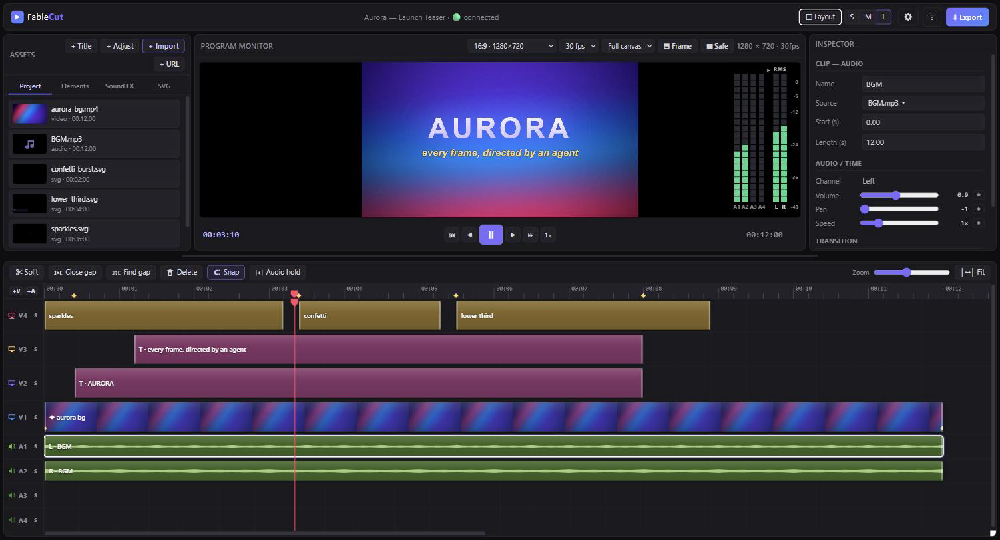

<div align="center">

<pre align="center">
███████╗ █████╗ ██████╗ ██╗     ███████╗ ██████╗██╗   ██╗████████╗
██╔════╝██╔══██╗██╔══██╗██║     ██╔════╝██╔════╝██║   ██║╚══██╔══╝
█████╗  ███████║██████╔╝██║     █████╗  ██║     ██║   ██║   ██║   
██╔══╝  ██╔══██║██╔══██╗██║     ██╔══╝  ██║     ██║   ██║   ██║   
██║     ██║  ██║██████╔╝███████╗███████╗╚██████╗╚██████╔╝   ██║   
╚═╝     ╚═╝  ╚═╝╚═════╝ ╚══════╝╚══════╝ ╚═════╝ ╚═════╝    ╚═╝   
</pre>

**Un editor de vídeo en el navegador que los agentes de IA pueden manejar.**

<a href="https://trendshift.io/repositories/77702?utm_source=trendshift-badge&amp;utm_medium=badge&amp;utm_campaign=badge-trendshift-77702" target="_blank" rel="noopener noreferrer"></a>

[](https://news.ycombinator.com/item?id=48845422)
[](https://dev.to/devteam/top-7-featured-dev-posts-of-the-week-815)
[](https://registry.modelcontextprotocol.io/v0/servers?search=fablecut)
[](https://github.com/punkpeye/awesome-mcp-servers)
[](https://glama.ai/mcp/servers/ronak-create/FableCut)
[](https://glama.ai/mcp/best/browser-automation)
[](https://deepwiki.com/ronak-create/FableCut)
[](https://discord.gg/EFMQH7d6Tv)

[English](../../README.md) · [简体中文](README.zh-CN.md) · [日本語](README.ja.md) · **Español** · [Português (BR)](README.pt-BR.md)

</div>

<https://github.com/user-attachments/assets/2430b854-168b-4a9a-af2e-489e5efa7543>

FableCut es un editor de vídeo no lineal al estilo Premiere que funciona
enteramente en tu navegador — y que expone toda su línea de tiempo como **un
único documento JSON**. Edítalo a mano, desde la interfaz, o deja que un agente
de IA (Claude Code, Claude Desktop o cualquier cosa que hable MCP/REST) monte el
vídeo por ti mientras ves la línea de tiempo actualizarse en vivo.

Cero dependencias de npm. Un `node server.js`. Eso es todo.



## Por qué resulta interesante

La mayoría de las herramientas de «vídeo con IA» esconden el montaje detrás de
una API. FableCut le da la vuelta: **el archivo de proyecto es la interfaz**.
`project.json` describe medios, clips, pistas, efectos, fotogramas clave y
transiciones — cualquier proceso capaz de escribir JSON puede editar vídeo, y la
interfaz abierta en el navegador se recarga en caliente en unos 150 ms mediante
server-sent events. Una persona y un agente pueden trabajar sobre la misma línea
de tiempo al mismo tiempo.

## Funciones

**Edición**

- 3 pistas de vídeo + 4 de audio, arrastrar/recortar/dividir/imantar, deshacer y
  rehacer
- **Ajustes** (el engranaje de la barra superior) — preferencias opcionales
  guardadas en este navegador vía `localStorage`. Activa **Vincular la selección
  de la línea de tiempo y del panel Project** para que, al elegir un clip, se
  resalte su medio en Project, y al pulsar un elemento de Project se seleccionen
  todos los clips que lo usan (desactivado por defecto).
- **Manipulación directa en el monitor** — pulsa un clip o un rótulo en la vista
  previa para moverlo, redimensionarlo (tiradores de esquina) o rotarlo (tirador
  superior, con Shift se imanta) sin salir de ahí
- **Selección múltiple en la línea de tiempo** — marco elástico (arrastra sobre
  una zona vacía de la pista), <kbd>Ctrl/Cmd/Shift+clic</kbd> para añadir o
  quitar clips, <kbd>Ctrl+A</kbd> para seleccionar todo y <kbd>Esc</kbd> para
  deseleccionar. Arrastra cualquier clip seleccionado y se mueve el grupo
  entero; <kbd>Delete</kbd> borra toda la selección; <kbd>S</kbd> divide todos
  los seleccionados en el cabezal. El inspector muestra un aviso de «N clips
  seleccionados».
- Marcadores de ritmo y de referencia (pulsa <kbd>⇧m</kbd> a tiempo durante la
  reproducción) con imantado de los bordes
- Pulsa <kbd>Alt+t</kbd> para añadir una transición de entrada o salida según la
  posición del cabezal sobre el clip seleccionado. La última transición usada se
  recuerda como predeterminada. Arrastra el triángulo superpuesto para ajustar la
  duración; <kbd>Delete</kbd> elimina la transición enfocada.
- Formas de onda reales, decodificadas, sobre los clips
- **Carpetas en el panel Project** — vista de árbol que se expande y contrae;
  arrastra medios o carpetas para anidarlos; clic derecho en la pestaña
  **Project** → Nueva carpeta; suelta archivos sobre una carpeta para importarlos
  directamente dentro
- **Audio Hold** — un interruptor de la barra de la línea de tiempo: en pausa,
  repite en bucle **un fotograma** de audio en el cabezal (útil al avanzar
  fotograma a fotograma). Al desplazar el cabezal o avanzar un fotograma, el
  fragmento retenido se recoloca; los medidores siguen activos. **Play** o
  **Pause** lo desactivan.
- Preajustes de relación de aspecto (16:9, 9:16 para reels, 4:5, 1:1) + selector
  de FPS del proyecto (24 / 25 / 30 / 50 / 60; otras tasas aparecen como
  Custom) + guías de zona segura
- **Zoom del monitor de programa** — la rueda del ratón sobre la vista previa
  amplía la composición hacia el cursor (desde ajustar a la vista hasta **2
  píxeles de pantalla por píxel de lienzo**). Ampliado, usa **barras de
  desplazamiento nativas** para que lo que sobresale siga siendo accesible; se
  desplaza con clic central o <kbd>Alt</kbd>+arrastrar. El botón **Fit** (visible
  al ampliar) vuelve al ajuste base.
- Velocidad de reproducción de la vista previa — recorre 1× / 1,5× / 2× / 4× con
  **J** / **K** / **L** (desde parado, <kbd>J</kbd> y <kbd>L</kbd> inician la
  reproducción; en marcha, <kbd>L</kbd> acelera y <kbd>J</kbd> frena, y
  <kbd>K</kbd> alterna reproducir/pausar y vuelve a 1×). Afecta solo al
  reproductor de vista previa, nunca a la exportación.
- Espacio de trabajo redimensionable: arrastra el divisor entre el monitor y la
  línea de tiempo (doble clic para restablecer), más preajustes de densidad de
  pista S/M/L (S oculta las miniaturas para pistas compactas)
- **Zoom a la selección** (<kbd>⇧Z</kbd>) encuadra todos los clips
  seleccionados, no solo uno
- **Área de trabajo IN/OUT** — coloca los marcadores con <kbd>i</kbd> y
  <kbd>o</kbd> (<kbd>⇧I</kbd> / <kbd>⇧O</kbd> los borran). Al activar **Limit**,
  la reproducción se restringe al rango marcado y <kbd>Home</kbd> / <kbd>End</kbd>
  saltan a las posiciones IN y OUT en lugar de a los extremos de la línea de
  tiempo. <kbd>t</kbd> divide los clips en los marcadores; <kbd>⇧t</kbd> los
  recorta al área de trabajo (entre el marcador de entrada y el de salida).
- **Buscar y cerrar huecos** — un hueco es un tramo en el que todas las pistas
  activas están vacías (fotogramas en negro). <kbd>g</kbd> lleva el cabezal al
  siguiente hueco común (da la vuelta al final; respeta IN/OUT cuando ambos están
  puestos). <kbd>⇧G</kbd> cierra el hueco bajo el cabezal arrastrando hacia la
  izquierda los clips posteriores de todas las pistas activas.
- **Restablecer una propiedad** — <kbd>Ctrl/Cmd+clic</kbd> sobre una **etiqueta**
  del inspector devuelve ese efecto o propiedad a su valor por defecto (los
  campos emparejados, como Crop L/R, se restablecen juntos). También se borran los
  fotogramas clave de esa propiedad; en las etiquetas de transición se eliminan
  las transiciones de entrada y salida.
- **Sustituir el medio** — el botón **Source** del inspector (en cualquier clip
  de vídeo, audio, imagen o svg) cambia el archivo de origen conservando la
  posición, el recorte, los fotogramas clave, las transiciones y todos los
  efectos. Elige otro elemento que ya esté en el panel o usa **Browse file…**
  para importar y sustituir de una vez. El audio L/R vinculado a un vídeo se
  sustituye con él; si el reemplazo es más corto, el recorte se ajusta para que
  quepa y un aviso te lo indica.
- **Audio de vídeo multicanal** — un vídeo con más de 2 canales de audio genera
  un clip de audio vinculado **por canal**, no solo L/R (5.1, 7.1…). Las pistas
  de audio adicionales (A5, A6, …, hasta 16) se crean automáticamente según haga
  falta; al sustituir el medio de un clip, los clips de canal vinculados se
  resincronizan con el número de canales del nuevo origen, añadiendo o quitando
  clips y pistas según convenga.

**Aspecto**

- 14 preajustes de filtro a un clic (cinematic, teal-orange, noir, vintage,
  cyberpunk, sunset, midnight…)
- **Capas de ajuste** — un clip corrige todo lo que tiene debajo, al estilo
  Premiere
- Controles de color completos: brillo/contraste/saturación/tono, **temperatura y
  matiz**, desenfoque, escala de grises/sepia/invertir, **viñeteado** y **grano
  de película** animado
- Modos de fusión (screen, multiply, overlay…), modos de encaje (contain / cover
  / stretch), recorte por cada borde, radio de esquina y volteo horizontal o
  vertical
- **Croma** (pantalla verde) con tolerancia y suavizado + supresión de derrame de
  color
- **Eliminación de fondo con IA** (recorte de personas, en el navegador mediante
  MediaPipe)

**Movimiento**

- Animación por fotogramas clave en unas 25 propiedades, con suavizado
- **Marcadores de fotograma clave en los clips** — un rombo en el cuerpo del clip
  por cada instante con fotogramas clave (la ayuda emergente enumera los canales;
  aparece un contador cuando varios comparten el mismo instante).
  <kbd>Ctrl/Cmd+←</kbd> / <kbd>Ctrl/Cmd+→</kbd> llevan el cabezal al fotograma
  clave anterior o siguiente (primero de los clips seleccionados; si no, de los
  que estén bajo el cabezal)
- **Gráficas de fotogramas clave** — activa la curva de una propiedad en el
  inspector para ver junto al monitor de programa la gráfica de valores
  interpolados; pulsa la gráfica para desplazarte
- **Rampas de velocidad** — pon fotogramas clave en `speed` y el motor remapea el
  tiempo del vídeo *y* de la mezcla de audio exportada (el clásico recurso de
  reel: rápido y de golpe a cámara lenta)
- **Vibración de cámara** y **separación RGB / aberración cromática**, ambas
  animables
- 17 transiciones: fundidos, deslizamientos, barridos (4 direcciones), zoom,
  iris, giro, desenfoque, barrido de cámara (whip-pan), **glitch** y **pop**

**Texto**

- **Estilos de rótulo** — looks coherentes a un toque (Impact, Elegant, Kinetic
  cut, Neon, Handwritten, Luxury y más); los rótulos nuevos varían solos la
  tipografía, la posición y la animación en lugar de caer siempre en un mismo
  estilo plano
- Subtítulos cinéticos: typewriter, word-pop, word-slide, karaoke,
  **letter-pop**, **wave**, **bounce**, **shake**, **clip-reveal**, **zoom-in**,
  **font-cut** (cortes rítmicos de tipografía) y **rise-mask**
- **Brillo de neón** para ese aire de subtítulo de TikTok
- Editor de fuentes: tipografías del sistema, fuentes propias que solo hay que
  soltar en `library/fonts/` y **cualquier Google Font por su nombre**, cargada
  automáticamente
- Rellenos de degradado, contorno, píldoras de fondo, espaciado entre letras,
  interlineado, grosores, cursiva, mayúsculas y sombras suaves
- **Composición del texto** — alineación horizontal: izquierda / centro / derecha
  / **justificado** (añade espacios entre palabras). Arrastra los tiradores de
  esquina de un rótulo para crear una **caja de texto** (`boxW` / `boxH`); los
  siguientes arrastres la redimensionan (la esquina opuesta queda fija;
  <kbd>Ctrl/Cmd</kbd> redimensiona desde el centro y <kbd>Shift</kbd> mantiene la
  proporción). Dentro de una caja, el texto se ajusta por defecto conservando el
  cuerpo de letra; activa **Scale to fit** para reducir la fuente hasta que quepa
  el bloque entero. **V-align** (arriba / centro / abajo) coloca el bloque
  verticalmente dentro de la caja. Pon Box W/H a `0` para volver al tamaño que se
  ciñe al contenido.

**Clips SVG animados**

- Un tipo de clip `svg` de primera clase: los SVG animados con `@keyframes` de
  CSS se renderizan **con precisión de fotograma** tanto en la vista previa como
  en la exportación (el compositor congela la animación en cualquier instante).
  Los agentes pueden crear sus propias superposiciones vectoriales — rótulos
  inferiores, confeti, destellos — como simples archivos `.svg`. Se incluyen
  ejemplos de partida.

**Rehacer un vídeo de referencia**

- Dale un montaje de referencia (un reel que te guste) y recibirás un **plano de
  montaje**: los límites de cada plano, los tiempos y el BPM de la música, una
  curva de intensidad sonora, la energía de cada plano, el drop — además de la
  **música de la referencia extraída** a tus medios, lista para reconstruir la
  misma idea con tu propio material. Sin dependencias añadidas (ffmpeg se encarga
  de decodificar; la detección de ataques y tempo es Node puro).
  `node analyze.js ref.mp4`, `POST /api/analyze` o la herramienta MCP
  `fablecut_analyze_reference`.

**Biblioteca de recursos**

- Las carpetas de `library/` aparecen como pestañas en la interfaz:
  **Elements** (arte de superposición), **Sound FX** y **SVG** — deja ahí los
  archivos y el editor abierto se actualiza al instante

**Exportación**

- Exportación rápida: el navegador renderiza cada fotograma y una mezcla de audio
  offline, y ffmpeg codifica un MP4 CRF-18 con precisión de fotograma (sigue
  renderizando aunque cambies de pestaña)
- Alternativa en tiempo real con MediaRecorder cuando ffmpeg no está disponible

## Inicio rápido

```bash
git clone https://github.com/ronak-create/FableCut.git
cd FableCut
node server.js        # → http://localhost:7777
```

Requisitos: **Node 18+** y un navegador basado en Chromium. Tener **ffmpeg en el
PATH** es opcional pero recomendable (exportación rápida y remux de las subidas).
La eliminación de fondo con IA descarga su modelo de una CDN la primera vez que
se usa.

El servidor escucha **solo en 127.0.0.1** (desde la v1.3.1). Para usarlo desde
otro dispositivo de tu red local, actívalo explícitamente:
`HOST=0.0.0.0 FABLECUT_ALLOWED_HOSTS=<tu-ip> node server.js`.

Suelta tus medios en la ventana (o en `./media/`), arrastra los clips a la línea
de tiempo, edita y exporta.

## Manejarlo con un agente de IA

Todo lo que un agente necesita está en **[CLAUDE.md](../../CLAUDE.md)**: el
esquema completo, la semántica y un recetario. Apunta cualquier modelo capaz a
ese archivo y podrá operar el editor de principio a fin.

> 📖 **Documentación navegable:** para un recorrido conversacional y generado
> automáticamente por el código — arquitectura, el esquema de `project.json`, la
> superficie MCP — visita
> **[FableCut en DeepWiki](https://deepwiki.com/ronak-create/FableCut)**. Puedes
> hacerle preguntas sobre el repositorio en lenguaje natural.

Tres superficies de control equivalentes:

1. **MCP** (lo mejor para Claude Code / Claude Desktop) — registra una sola vez
   el servidor MCP incluido, que no tiene dependencias:

   ```bash
   claude mcp add -s user fablecut -- node "<ruta-a>/fablecut/mcp-server.js"
   ```

   Herramientas: `fablecut_status` (arranca el editor solo), `fablecut_docs`,
   `fablecut_get_project`, `fablecut_set_project`, `fablecut_patch_project`,
   `fablecut_import_media`, `fablecut_analyze_reference`.

   FableCut también está publicado en el **registro oficial de MCP** como
   [`io.github.ronak-create/fablecut`](https://registry.modelcontextprotocol.io/v0/servers?search=fablecut)
   — cada versión incluye un paquete MCPB (`fablecut.mcpb`) que los clientes
   compatibles con MCPB pueden instalar directamente.

   La superficie está **pensada para gastar pocos tokens**: los agentes parchean
   la línea de tiempo con operaciones pequeñas (`fablecut_patch_project`) en vez
   de mandar el documento entero de ida y vuelta, leen un resumen compacto de una
   línea por clip (`fablecut_get_project {compact:true}`) y piden solo las
   secciones del manual que necesitan (`fablecut_docs {section:"props"}`).
2. **El archivo** — lee `project.json`, modifícalo, incrementa `revision` y
   escríbelo. La interfaz se recarga sola.
3. **REST** — `GET/PUT /api/project`, `POST /api/upload`, `GET /api/library` y
   SSE en `/api/events`. La lista completa está en CLAUDE.md.

Un ejemplo: pídele a Claude Code *«corta estos seis clips siguiendo los
marcadores de ritmo, aplica un grado teal-orange, pon encima un rótulo word-pop y
un whoosh en cada corte»* — y observa cómo la línea de tiempo se reconstruye
sola.

O pásale una referencia: *«esta reel me gusta: analízala y rehazla con mis clips,
con la misma música»*. El agente llama a `fablecut_analyze_reference`, obtiene el
plano de montaje (cortes, ritmos, BPM, energía, el drop y la música extraída) y
reconstruye la estructura plano a plano con tu material.

**Edición concurrente sin pisadas**: la interfaz, las herramientas MCP y la
escritura directa de `project.json` comparten un contador `revision`. Si tocas un
clip en la interfaz mientras un agente está trabajando, la siguiente escritura
del agente se rechaza (409 desde la API REST, o un error de conflicto en
`fablecut_set_project`) en lugar de sobrescribir tu cambio en silencio. La
interfaz detecta igualmente cuándo una escritura del agente deja atrás un ajuste
local sin guardar, y te lo avisa con un mensaje en vez de descartarlo sin más.

## Estructura del proyecto

```
server.js        servidor HTTP sin dependencias: archivos estáticos, API REST,
                 SSE y la cadena de exportación con ffmpeg
app.js           el editor: interfaz de la línea de tiempo, compositor,
                 fotogramas clave, motor de texto, rasterizador SVG, croma,
                 exportadores
index.html       interfaz de página única
style.css        tema oscuro del editor
mcp-server.js    servidor MCP por stdio que expone el editor a los agentes
analyze.js       analizador de vídeos de referencia: planos, ritmos/BPM,
                 energía, drop y extracción de música (módulo y CLI)
CLAUDE.md        el manual para agentes (esquema + recetas), también servido por
                 fablecut_docs
project.json     tu línea de tiempo (se crea al arrancar; en .gitignore)
media/           material del proyecto (en .gitignore)
analysis/        planos de montaje cacheados por /api/analyze (en .gitignore)
library/         recursos por defecto: elements/ sfx/ svg/ fonts/
exports/         renders terminados (en .gitignore)
```

## Crear superposiciones SVG animadas

Los SVG se animan con `@keyframes` de CSS a secas. Solo hay una convención: nunca
fijes `animation-delay` a mano — pon `--d: 0.4s` en su lugar, y el compositor
llevará el tiempo pausando todas las animaciones y recalculando sus retardos.
Las reglas completas y un esqueleto están en
[CLAUDE.md](../../CLAUDE.md#authoring-animated-svgs-the-svg-clip-kind); hay
ejemplos que funcionan en [`library/svg/`](../../library/svg/).

## Notas

- El repositorio incluye **20 Google Fonts** (`library/fonts/`, con licencia OFL
  — mira `LICENSES.md` ahí dentro) y un conjunto propio de superposiciones SVG y
  elementos animados (`library/elements/`, `library/svg/`, MIT como el resto del
  repositorio).
- `library/sfx/` la llenas tú (está en .gitignore): los sitios de efectos de
  sonido no suelen permitir redistribuir sus archivos en un repositorio público,
  así que FableCut no lo hace — `library/sfx/README.md` enumera buenas fuentes
  gratuitas.
- La exportación ocurre en el navegador porque el compositor *es* el navegador;
  los agentes te piden que pulses Export (o renderizan directamente con ffmpeg
  desde `media/`).

## Comunidad

¿Preguntas, ideas, ganas de enseñar un montaje o de ayudar a decidir qué viene
después? Únete al **[Discord de FableCut](https://discord.gg/EFMQH7d6Tv)**. Para
errores y peticiones de funciones, mejor abrir un
[issue en GitHub](https://github.com/ronak-create/FableCut/issues).

## Licencia

[MIT](../../LICENSE)

---

<sub>Traducción sincronizada con <a href="../../README.md">README.md</a> en
<code>3dd1d55</code>. El README en inglés es la referencia; si algo se queda
desactualizado, abre un issue o un PR.</sub>
